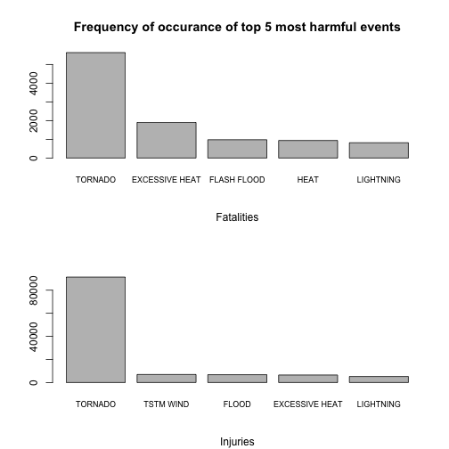
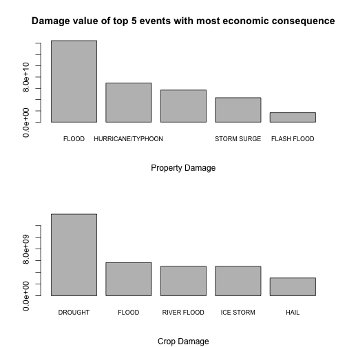

Analysis of NOAA Storm Data for Assignment 2
========================================================

# Synopsis
In this document, we analyzed the NOAA Storm Data to answer the following two questions:

1. Which types of events are most harmful with respect to population health?
2. Which types of events have the greatest economic consequences?

Based on our analysis, we conclude that in terms of population heath, both in terms of injuries and fatalities, Tornado is the most harmful. In terms of property damages, flood has the greatest economic consequences, whereas in terms of crop damages, drought has the greatest economic consequences.

# Data Processing
First, we load the data into *dat* variables. 


```r
dat = read.csv("StormData.csv.bz2")
names(dat)
```

```
##  [1] "STATE__"    "BGN_DATE"   "BGN_TIME"   "TIME_ZONE"  "COUNTY"    
##  [6] "COUNTYNAME" "STATE"      "EVTYPE"     "BGN_RANGE"  "BGN_AZI"   
## [11] "BGN_LOCATI" "END_DATE"   "END_TIME"   "COUNTY_END" "COUNTYENDN"
## [16] "END_RANGE"  "END_AZI"    "END_LOCATI" "LENGTH"     "WIDTH"     
## [21] "F"          "MAG"        "FATALITIES" "INJURIES"   "PROPDMG"   
## [26] "PROPDMGEXP" "CROPDMG"    "CROPDMGEXP" "WFO"        "STATEOFFIC"
## [31] "ZONENAMES"  "LATITUDE"   "LONGITUDE"  "LATITUDE_E" "LONGITUDE_"
## [36] "REMARKS"    "REFNUM"
```

From the *Storm Data Documentation*, we know that the Property Damage and Crop Damage data has a number and exponent portion. Therefore, we need to multiply these two parts together to get the final damage value. We used the following codes


```r
#preprocess PROPDMG
levels(dat$PROPDMGEXP)
```

```
##  [1] ""  "-" "?" "+" "0" "1" "2" "3" "4" "5" "6" "7" "8" "B" "h" "H" "K"
## [18] "m" "M"
```

```r
dat$PropExp[dat$PROPDMGEXP=="" | dat$PROPDMGEXP=="?" |dat$PROPDMGEXP=="-"|dat$PROPDMGEXP=="+"|dat$PROPDMGEXP=="0" ]=10^0
dat$PropExp[dat$PROPDMGEXP=="1" ]=10^1
dat$PropExp[dat$PROPDMGEXP=="2" |dat$PROPDMGEXP=="h"|dat$PROPDMGEXP=="H"]=10^2
dat$PropExp[dat$PROPDMGEXP=="3"|dat$PROPDMGEXP=="K" ]=10^3
dat$PropExp[dat$PROPDMGEXP=="4" ]=10^4
dat$PropExp[dat$PROPDMGEXP=="5" ]=10^5
dat$PropExp[dat$PROPDMGEXP=="6"|dat$PROPDMGEXP=="m"|dat$PROPDMGEXP=="M" ]=10^6
dat$PropExp[dat$PROPDMGEXP=="7" ]=10^7
dat$PropExp[dat$PROPDMGEXP=="8" ]=10^8
dat$PropExp[dat$PROPDMGEXP=="B" ]=10^9
```
Similar analysis from crop damage data:


```r
#preprocess CROPDMGEXP
levels(dat$CROPDMGEXP)
```

```
## [1] ""  "?" "0" "2" "B" "k" "K" "m" "M"
```

```r
dat$CropExp[dat$CROPDMGEXP==""|dat$CROPDMGEXP=="?"|dat$CROPDMGEXP=="0" ]=10^0
dat$CropExp[dat$CROPDMGEXP=="2" ]=10^2
dat$CropExp[dat$CROPDMGEXP=="k"|dat$CROPDMGEXP=="K" ]=10^3
dat$CropExp[dat$CROPDMGEXP=="m"|dat$CROPDMGEXP=="M" ]=10^6
dat$CropExp[dat$CROPDMGEXP=="B" ]=10^9


dat$PropDmgVal = dat$PROPDMG * dat$PropExp
dat$CropDmgVal = dat$CROPDMG * dat$CropExp
```

# Results
## Population Health
To determine which events are most harmful to population health, we aggregate the *fatalities* and *injuries* data in terms of different events and sorted them from most harmful to least. Codes shown below:


```r
# Polulation Health
fatRes = aggregate(dat$FATALITIES, by=list(dat$EVTYPE),sum,na.rm=T)
names(fatRes) = c("Event Type", "Number")
fatRes = fatRes[order(fatRes$Number,decreasing=T),]

injRes = aggregate(dat$INJURIES, by=list(dat$EVTYPE),sum,na.rm=T)
names(injRes) = c("Event Type", "Number")
injRes = injRes[order(injRes$Number,decreasing=T),]
```

Then, we plot the most harmful 5 events in terms of fatalities and injuries.

```r
par(mfrow=c(2,1))
barplot(fatRes$Number[1:5],sub="Fatalities",names.arg=fatRes$"Event Type"[1:5],cex.names=0.75)
title(main="Frequency of occurance of top 5 most harmful events")
barplot(injRes$Number[1:5],sub="Injuries",names.arg=injRes$"Event Type"[1:5],cex.names=0.75)
```

 

## Economic Consequences
To determine the events which have the most economic consequences, we aggregate the *Property Damage* and *Crop Damage* data in terms of different events. We then sort these event from most economic consequences to least. Codes given below:


```r
propRes = aggregate(dat$PropDmgVal, by=list(dat$EVTYPE),sum,na.rm=T)
names(propRes) = c("Event Type", "Value")
propRes = propRes[order(propRes$Value,decreasing=T),]

cropRes = aggregate(dat$CropDmgVal, by=list(dat$EVTYPE),sum,na.rm=T)
names(cropRes) = c("Event Type", "Value")
cropRes = cropRes[order(cropRes$Value,decreasing=T),]
```

We then plot the events with the most economic consequences in terms of Property Damage and Crop Damage.


```r
par(mfrow=c(2,1))
barplot(propRes$Value[1:5],sub="Property Damage",names.arg=propRes$"Event Type"[1:5],cex.names=0.75)
title(main="Damage value of top 5 events with most economic consequence")
barplot(cropRes$Value[1:5],sub="Crop Damage",names.arg=cropRes$"Event Type"[1:5],cex.names=0.75)
```

 

# Conclusion
From the first figure, we conclude that tornado is most harmful events with respect to population health. From the second figure, we conclude that flood is the event with the most economic consequences to property damage. We also conclude that drought is the event with the most economic consequences to crop damage.
